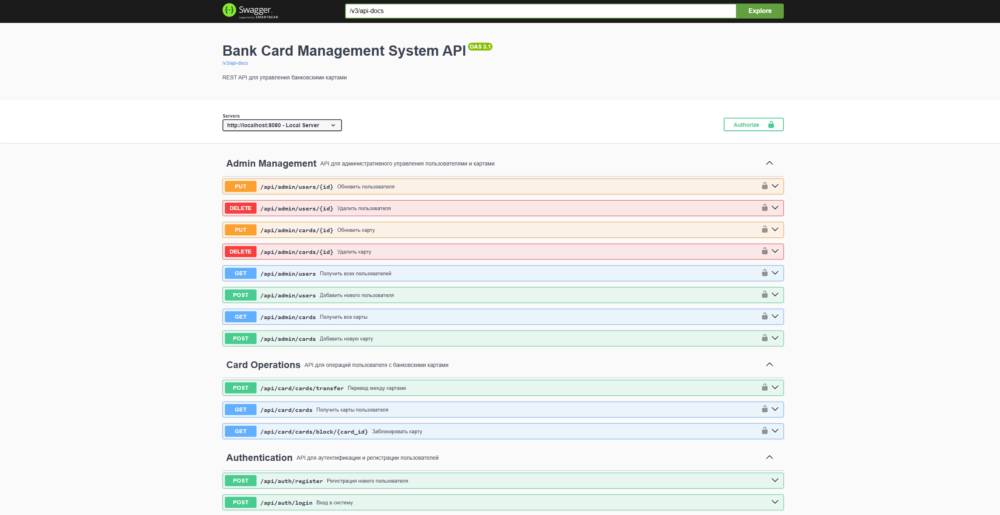

# 🚀 Bank Card Management System
(fixed)

Система управления банковскими картами с JWT аутентификацией и ролевым доступом.

## 🛠 Технологии
- Java 23, Spring Boot 3.5.6
- Spring Security + JWT
- PostgreSQL 17
- Docker + Docker Compose
- Swagger/OpenAPI 3.0
- Liquibase (миграции БД)

## 🚀 Быстрый запуск

### Предварительные требования
- Установленный Docker Desktop
- Порт 8080 и 5432 свободны

### Запуск приложения
```bash
# Клонируйте репозиторий
git clone https://github.com/FreEFreeZy/banksystem
cd banksystem

# Запустите приложение
docker-compose up -d
```

### Проверьте работоспособность: откройте http://localhost:8080/swagger-ui/index.html#/



### В БД автоматически добавятся два пользователя и две карты:
- Пользователь 1 - (admin, password, ROLE_ADMIN)
- Пользователь 2 - (user, password, ROLE_USER)
- Карта 1 - (1234567890123456, user, 2030-01-01, 50, ACTIVE)
- Карта 2 - (1234567890123457, user, 2030-01-01, 30, ACTIVE)

